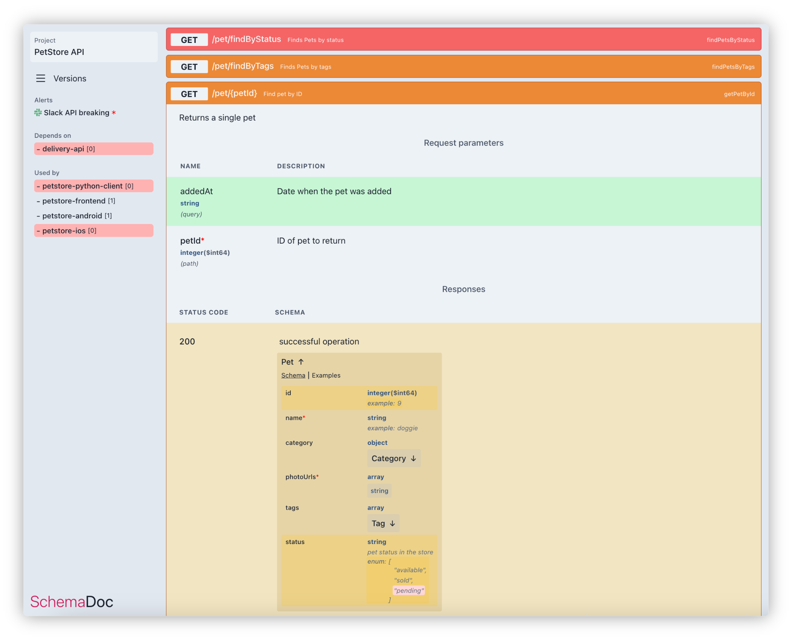

# SchemaDoc

## WIP (work-in-progress)

SchemaDoc is an open-source project that allows you to compare OpenAPI schemas and visualize the results in a
Swagger-like manner. It provides a convenient way to track changes between different versions of OpenAPI schemas and
identify breaking changes.



## Features

- **Projects, Branches and Versions**: You can create projects and manage multiple versions of OpenAPI schemas within
  each project.
  As well as you can create branches for different development paths, ensuring that your API's evolution is
  well-structured and organized.
- **Data Sources**: SchemaDoc supports configuring data sources to pull OpenAPI schemas from. Currently, it only
  supports basic URL GET requests. You can specify the URL from which the schema should be fetched and branch where the
  load retrieved schema
- **Scheduled Data Pulling**: SchemaDoc allows you to schedule the pulling of OpenAPI schemas from the configured data
  sources. By default, it pulls the data every 5 minutes, ensuring that you always have the most up-to-date information.
- **Breaking Changes**: SchemaDoc calculates breaking changes between different versions of OpenAPI schemas. It helps
  you
  identify modifications that may cause compatibility issues with existing clients.
- **Alerts**: You can configure alerts to receive notifications about schema changes. SchemaDoc supports sending summary
  alerts to Slack or Google Chat. There are two kinds of alerts available:
    - **all**: Send an alert for any change detected in the schema.
    - **breaking**: Send an alert only if there are breaking changes in the schema.
- **File-based Storage**: SchemaDoc does not require a database. It stores all data in files, making it easy to set up
  and
  deploy.
- **Dependencies**: SchemaDoc supports specifying dependencies between projects. This allows you to track how changes in
  one project may impact the other.

## Configuration (`schemadoc.yaml`)

The configuration file for SchemaDoc (schemadoc.yaml) follows the structure below:

```yaml
version: "0.1"

projects:
  stripe:
    name: Strip API
    description: empty
    alerts:
      - name: Slack breaking
        kind: breaking
        source: own
        is_active: true
        service: Slack
        service_config:
          hook: https://hooks.slack.com/services/ABCDEFGHIJK/123456789/A1B2C3D4e5f6
    data_sources:
      - name: Stripe Github raw
        source: !Url { url: https://raw.githubusercontent.com/stripe/openapi/master/openapi/spec3.json }
      - name: Stripe dev
        branch: development
        source: !Url { url: https://raw.githubusercontent.com/stripe/openapi/trigger/openapi/spec3.json }

    links:
      - name: API Reference
        url: https://stripe.com/docs/api

  stripe-python-client:
    name: Stripe Python Client
    kind: client
    dependencies: # Could be set for both kind=`server` and `client`
      stripe: 1 # Versions ids are autoincremented 0, 1, 2, ...
```

In this configuration file, you can define multiple projects under the data section. Each project has a unique slug,
name, and description. You can configure alerts for each project, specifying their name, kind, source, and other related
information.

The **data_source** section allows you to configure the data source from which the OpenAPI schema will be pulled.
Currently, only basic HTTP GET requests are supported. You can provide the name and URL of the data source.

There are two kinds of projects `server` and `client`, they differ only visually on UI. Client does not have
versions and overview page shows the client dependencies.

## Limitations

At the moment these parts are not implemented or are partially implemented:

- **OpenAPI**: `info`, `tags`, `webhooks`, `links`, `servers`, `security`, parts from OpenAPI 3.1, ...
- **Breaking Changes** are not displayed and are only used internally in alerts with `kind=breaking`
- **Persistence** only for OS file system supported for now

## Getting Started

### TODO

## Configuration schema (`schemadoc.yaml`)

## Environment variables

| Variable                        | Default          | Description                                                                                            |
|---------------------------------|------------------|--------------------------------------------------------------------------------------------------------|
| `SD_BASIC_AUTH`                 | `admin:password` | Authorization credentials for modification operations: `Authorization: Basic <base64($SD_BASIC_AUTH)>` |
| `SD_PERSISTENCE`                | `local`          | Persistence type, one of [`local`]                                                                     |
| `SD_PERSISTENCE_PATH`           | `./persistence`  | Path to load and store persistent data in selected persistence                                         |
| `SD_CONFIG_PERSISTENCE`         | `local`          | Persistence type for `schemadoc.yaml`, one of [`local`]                                                |
| `SD_CONFIG_PERSISTENCE_PATH`    | `./persistence`  | Path to read `schemadoc.yaml` in selected config persistence                                           |
| `SD_PULL_DISABLE_AFTER_ATTEMPT` | `0`              | After how many errors to disable datasource pulling, set `0` to do not disable pulling                 |

## Modifying Endpoints

**All the endpoints below require HTTP request header `Authorization: Basic <token>` provided, where `token`
is `base64($SD_BASIC_AUTH)` from environment variables**

### `POST /api/v1/projects/{slug}/branches/{name}/versions`

Add new version to the specified project branch.

**Parameters:**

| name                       | in     | type               | description                                                          |
|----------------------------|--------|--------------------|----------------------------------------------------------------------|
| `slug`                     | path   | `string`           | Project slug                                                         |
| `name`                     | path   | `string`           | Branch name                                                          |
|                            | body   | `json`             | Schema content in json                                               |
| `X-Message`                | header | `optional[string]` | Version description                                                  |
| `X-Branch-Base-Name`       | header | `optional[string]` | Base name of new branch if the branch `name` does not exist          |
| `X-Branch-Base-Version-Id` | header | `optional[string]` | Version id from base branch from which the new branch will be forked |

**Response:**

- `201 Created`: returns new version data if it was created, and returns `null` if the version has no changes
  compared to previous one and thus was not actually created

### `POST /api/v1/projects/{slug}/branches`

Creates new branch

**Parameters:**

| name            | in   | type               | description                                                          |
|-----------------|------|--------------------|----------------------------------------------------------------------|
| `slug`          | path | `string`           | Project slug                                                         |
| `name`          | body | `string`           | Branch name to create                                                |
| `baseName`      | body | `optional[string]` | Base branch name, if `null` then project's default branch used       |
| `baseVersionId` | body | `optional[number]` | Version id from base branch from which the new branch will be forked |

**Response:**

- `201 Created`: returns new branch data if it was created, and `null` if it is already exists

### `DELETE /api/v1/projects/{slug}/branches/{name}`

Removes branch and all its versions

**Parameters:**

| name    | in    | type             | description                                           |
|---------|-------|------------------|-------------------------------------------------------|
| `slug`  | path  | `string`         | Project slug                                          |
| `name`  | path  | `string`         | Branch name to remove                                 |
| `force` | query | `optional[bool]` | If `true` then cascade remove all descenders branches |

**Response:**

- `204 No Content`

### `POST /api/v1/projects/{slug}/pull`

Pull enabled project datasources

**Parameters:**

| name    | in    | type             | description                                                               |
|---------|-------|------------------|---------------------------------------------------------------------------|
| `slug`  | path  | `string`         | Project slug                                                              |
| `force` | query | `optional[bool]` | If `true` then pull even if there is an active timeout for the datasource |

**Response:**

- `200 Ok`: Pulled

## Contributions

SchemaDoc is an open-source project, and contributions are welcome. If you have any ideas, suggestions, or bug reports,
please feel free to submit them to the project's repository.

## License

SchemaDoc is released under the Apache 2.0 License.
